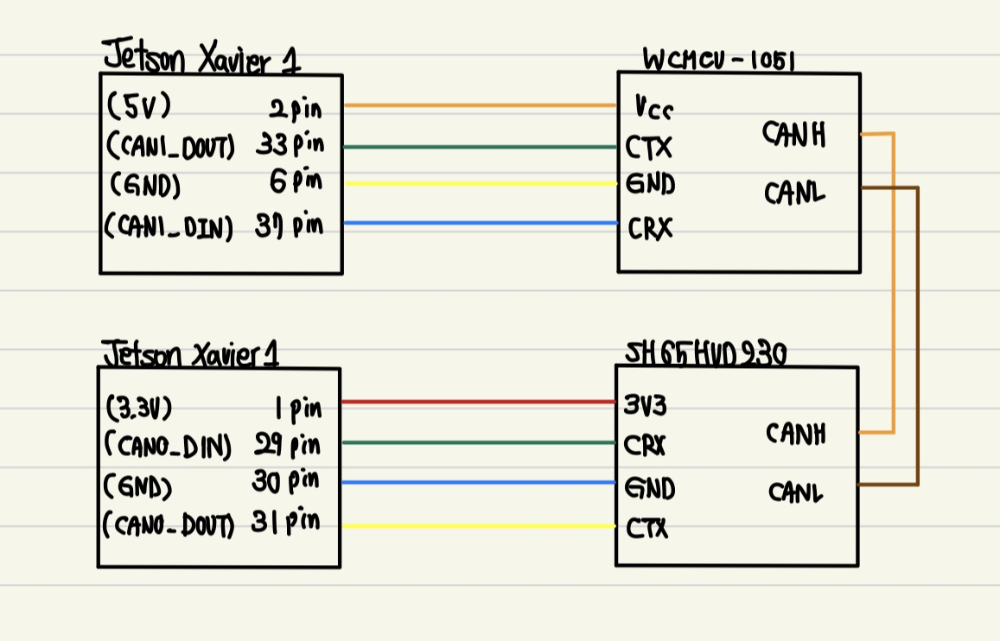

# CAN

## 목차
* [CAN통신 개념](#CAN통신)
* [CANFD통신 개념](#CANFD통신)
* [코드 설명](#코드-설명)
* [Hardware](#Hardware-Setting)
* [Software](#Software-Setting)
* [Problem](#Problems-when-testing-CAN)

## CAN통신
* 과거 자동차의 통신 방식 : 기계식
    기술의 발전으로 자동차에 다양한 모듈(ECU)이 생겨났고 이러한 모듈들이 서로 통신하기 위해 비동기 직렬 통신 방식은 UART를 사용했다.
  
    그러나 UART통신은 각 모듈이 1:1 통신을 해서 모듈이 추가될 때마다 더 많은 연결 선이 필요했다. 수많은 연결 선은 자동차의 공간을 점점 더 많이 차지하게 되었고 이는 자동차 무게가 증가하고 원가가 상승하는 결과를 초래했다.
    여러 개의 CAN 장치가 서로 통신할 수 있으며, 하나의 CAN 인터페이스로 여러 개의 모듈을 제어할 수 있어서 연결 선 수의 감소, 자동차 무게의 경감, 원가 하락 뿐만 아니라 효율적으로 시스템 제어가 가능해졌다.
  
    CAN통신은 여러 개 ECU를 병렬로 연결하여 데이터를 주고 받는 통신 방법이다. CAN버스를 통해서 통신 선 상에 데이터를 띄어 놓고 필요한 데이터에 접근한다.
    CAN 버스에는 Master가 없어서 CAN 버스에서 데이터를 쉽게 접근 가능(버스가 비어 있다면 언제든 메시지 전송 가능) 
    CAN제어기는 CAN 버스 선이 다른 제어기에 의해서 사용 중인지 확인한다.
    우선순위가 높은 메시지가 CAN 버스의 사용 권한을 보장 받을 수 있으며 낮은 순위의 다른 노드는 대기해야 하며 자동으로 다음 버스 사이클에서 데이터 재전송

	* CAN Controller

   	내부 버퍼를 가지며 Transceiver에서 전달되는 수신 메시지에 대해 유효한 데이터인지 아닌지 ID기반으로 판별한 후 유효한 데이터인 경우 MCU로 전달한다. 송신 메시지의 경우 MCU에서 전송하고자 하는 데이터에 대해 CAN Transceiver로 전달한다.

	* CAN Transceiver
	
 	CAN 버스 혹은 MCU에서 전달되는 송수신 데이터를 전기적 신호로 변환한다. MCU로부터 전달된 데이터를 CAN 통신용 데이터로 변환하며, CAN 버스에서 전달된 CAN 통신 용 데이터를 MCU 송수신 용 데이터로 변환한다.
## CANFD통신
CAN통신이 오랫동안 ECU를 연결하는 직렬 버스 네트워크 통신으로 지배적이었지만, 차량 내 데이터 트래픽의 증가로 CAN 버스 네트워크에 높은 부하가 가해지면서 보다 나은 통신 방법을 필요로 했다.
    기존의 CAN에 기능을 추가하여 CAN버스 부하가 높아지기 때문에 지연 시간의 증가와 대역폭 부족한 경우 있는데, CAN FD에 옮겨 놓으면 대역 부족이 해소되기 대문에 네트워크를 분할할 필요가 없다.
    
* 기존 CAN 프로토콜의 8Bytes에서 64Bytes로 확장
* 데이터 전송 속도가 최대 5Mbps(대부분 2Mbps)까지 가능
* CRC Field의 증가로 데이터 보안 증가, 기존 CAN하드웨어 사용 가능

## 코드 설명
#### enable_can.sh
Jetson AGX Xavier에서 CAN 인터페이스를 설정하기 위한 .sh
## Hardware Setting
필요장비 : Jetson AGX Xavier, CAN Transceiver(SH65HVD230), Monitor, Keyboard


## Software Setting
1. Terminal 1에서 enable_can.sh 파일 실행
   ```
   $ sh enable_can.sh
   ```
2. Terminal 2에서 CAN 데이터 송신할 준비
   ```
   $ candump -x any
   ```
   *만약 하나의 can만 데이터 수신을 하고 싶다면,
   ```
   $ candump can0
   ```
   이와 같이 사용하면 됨.
3. Terminal 3에서 CAN 데이터 송신 테스트
   ```
   $ cansend can0 123#abcdabcd
   ```
   (참고. 에러 문구를 실시간으로 확인하고 싶다면, 아래의 명령어를 통해 확인 가능)
   ```
   $ dmesg -w
   ```
## Problems when testing CAN
